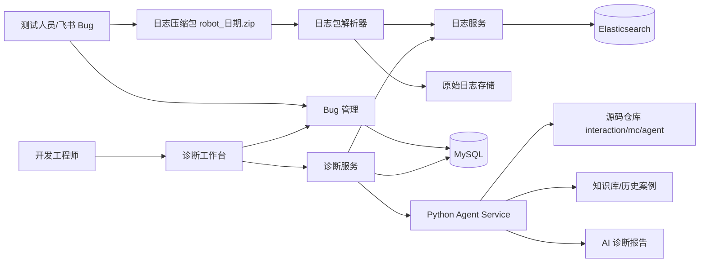
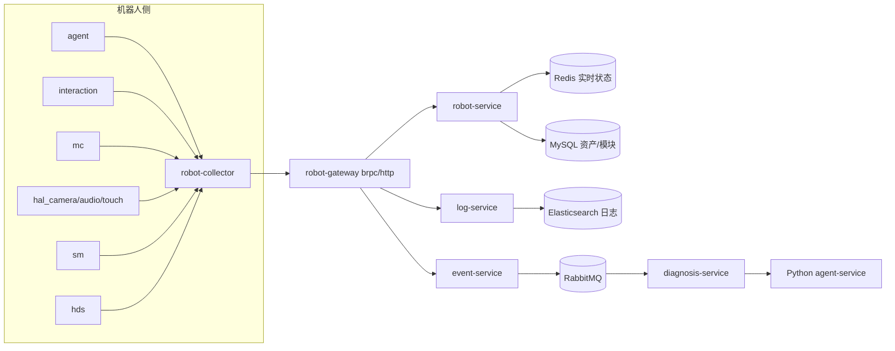

# RobotOps AI 架构设计

## 1. 总体架构



## 2. 双阶段架构定位

RobotOps AI 不是只做日志包分析。它采用同一套机器人、模块、日志、事件和诊断模型，支撑两个阶段：

| 阶段 | 主要输入 | 核心能力 | 输出 |
|---|---|---|---|
| 研发测试 | 飞书 Bug、日志压缩包、源码仓库 | 日志包解析、源码关联、AI Bug 诊断 | 诊断报告、历史案例 |
| 部署运维 | 机器人心跳、模块状态、事件告警、远程日志 | 实时监控、告警、远程诊断、工单闭环 | 告警、运维建议、维修记录 |

## 3. 部署运维实时监控扩展架构



## 2. 服务划分

### 4.1 C++ 平台微服务

语言：C++

继续参考 dev 项目的 brpc/protobuf 和 `cpp-microservice-kit` 脚手架能力。第一版可以实现为模块化服务，接口按微服务边界设计：

- `robot-gateway`：机器人侧数据接入，研发阶段接收日志包，部署运维阶段接收心跳/状态/事件。
- `robot-service`：机器人资产、机器人类型、模块清单和模块状态。
- `log-service`：日志包解析、日志写入、日志检索、时间窗口上下文查询。
- `ticket-service`：Bug 单和现场工单。
- `diagnosis-service`：诊断任务编排、调用 Python Agent、保存诊断报告。
- `event-service`：模块事件和告警。

第一版为了控制开发量，可以先合并实现：

```text
robot-gateway
log-service
ticket-diagnosis-service
agent-service
```

### 4.2 agent-service

语言：Python

职责：

- 解析 Bug 描述。
- 从日志上下文中提取关键证据。
- 根据日志关键句检索源码。
- 结合源码逻辑生成诊断报告。

### 4.3 source-repo indexer

当前不单独成服务，由 Agent 内置索引器完成：

- 平台按模块保存源码仓库地址，本地缺失时 clone，已有仓库在检索前 pull。
- 为 C/C++ 和 Python 建立函数符号、调用关系、接口路径和文件摘要索引。
- 索引绑定 Git revision；revision 更新时按 Git diff 增量刷新。
- 非 Git 本地目录通过文件状态检测变更，并生成 `workspace-*` 内容快照。
- 索引未命中或不可用时回退 `ripgrep`/文件搜索。

后续可扩展为独立代码索引服务，支持 tree-sitter、clangd index、向量检索和多实例共享缓存。

## 5. 数据流

### 5.1 Bug 诊断流程

```text
输入：
  Bug 标题、描述、机器人类型、发生时间、问题模块、日志包

处理：
  1. 保存 Bug 单
  2. 解压日志包
  3. 识别模块目录
  4. 解析日志并写入索引
  5. 按发生时间抽取上下文
  6. Agent 检索源码和历史案例
  7. 生成诊断报告

输出：
  疑似原因、证据日志、源码证据、责任模块、建议处理方向
```

### 5.2 日志包格式

```text
robot_20260730/
  interaction/interaction.log
  mc/mc.log
  agent/agent.log
  hds/hds.log
  hal_camera/hal_camera.log
  sm/sm.log
```

### 5.3 机器人实时状态流程

```text
输入：
  robot_id/robot_sn、robot_type、module_name、heartbeat、status、metrics、event

处理：
  1. robot-collector 采集模块心跳、状态和关键日志
  2. robot-gateway 接收入站数据
  3. robot-service 更新 Redis 实时状态
  4. event-service 生成模块事件或告警
  5. log-service 保存关键日志
  6. diagnosis-service 对高等级告警触发诊断任务

输出：
  机器人在线状态、模块健康状态、告警事件、远程诊断建议
```

## 6. 为什么不把实时监控作为第一阶段核心

当前业务发生在研发测试阶段，Bug 来源主要是测试人员提交的问题单和完整日志包，不是客户现场的大规模实时监控。

因此第一阶段优先解决：

- 日志包解析
- 时间线对齐
- interaction 核心链路分析
- 源码关联诊断

机器人售出后，可扩展实时心跳、模块在线状态和远程告警能力。
