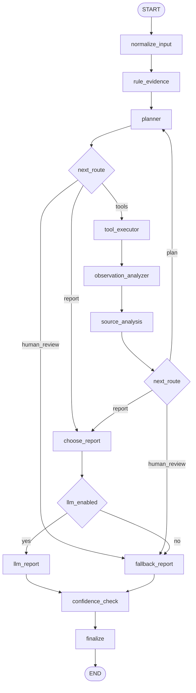

# LangGraph 诊断工作流详细设计

本文档定义 `agent-service` 后续 LangGraph 工作流的状态模型、节点职责、图结构、工具边界和验收标准。

目标不是把现有规则模板推翻，而是先把诊断过程拆成可观测、可测试、可降级的工作流。后续代码实现必须优先遵守本文档。

## 1. 设计依据

参考资料：

- LangGraph Graph API：<https://docs.langchain.com/oss/python/langgraph/use-graph-api>
- LangGraph Graph API overview：<https://docs.langchain.com/oss/python/langgraph/graph-api>
- LangChain Agents：<https://docs.langchain.com/oss/python/langchain/agents>
- LangChain Tools：<https://docs.langchain.com/oss/python/langchain/tools>
- LangChain Structured output：<https://docs.langchain.com/oss/python/langchain/structured-output>
- LangChain DeepSeek integration：<https://docs.langchain.com/oss/python/integrations/chat/deepseek>
- DeepSeek API models：<https://api-docs.deepseek.com/guides/function_calling/>

关键原则：

- LangGraph 用 `StateGraph` 编排诊断流程。
- State 使用 `TypedDict`，节点返回局部 state update，不直接原地修改 state。
- 证据、工具观察、执行 trace 使用 reducer 追加。
- 报告、计划、置信度、路由状态使用覆盖更新。
- LangChain 用于模型、工具和结构化输出，不承载业务状态机。
- DeepSeek 通过 `langchain-deepseek` 的 `ChatDeepSeek` 接入。
- 没有 `DEEPSEEK_API_KEY` 时必须走 deterministic fallback。

## 2. 外部接口边界

`agent-service` 对外保持现有接口：

```text
POST /diagnose
```

请求仍使用当前 `DiagnoseRequest`：

```text
bug
logs
sources
history_cases
knowledge
```

响应仍使用当前 `DiagnosisReport`：

```text
summary
suspected_module
possible_causes
evidence_logs
evidence_sources
recommended_actions
confidence
questions_for_human
agent_version
trace_id
diagnostic_trace
status
```

内部从直接调用 `rules.diagnose()` 演进为：

```text
DiagnoseRequest
  -> DiagnosisState
  -> LangGraph workflow
  -> DiagnosisReport
```

## 3. State 设计

第一版 State 使用 `TypedDict`，避免在每个节点之间反复做 Pydantic 深度校验。入口和出口继续由 FastAPI 的 Pydantic model 校验。

```python
from __future__ import annotations

import operator
from typing import Annotated, Any, Dict, List, Literal, Optional
from typing_extensions import TypedDict


class ToolRequest(TypedDict, total=False):
    tool_name: Literal["log_context", "source_search", "case_search", "knowledge_search"]
    reason: str
    args: Dict[str, Any]


class ToolObservation(TypedDict, total=False):
    tool_name: str
    ok: bool
    args: Dict[str, Any]
    result: Dict[str, Any]
    error: str


class Hypothesis(TypedDict, total=False):
    name: str
    suspected_module: str
    summary: str
    causes: List[str]
    evidence_log_refs: List[int]
    evidence_source_refs: List[int]
    confidence: float


class GraphTraceEvent(TypedDict, total=False):
    node: str
    event: str
    detail: str


class DiagnosisPlan(TypedDict, total=False):
    phase: Literal["collect_logs", "search_source", "retrieve_cases", "generate_report", "human_review"]
    reason: str
    tool_requests: List[ToolRequest]


class SourceInvestigation(TypedDict, total=False):
    queries: List[Dict[str, str]]
    stop: bool
    stop_reason: str
    planning_mode: Literal["deepseek", "deterministic"]


class DiagnosisState(TypedDict, total=False):
    request: Dict[str, Any]
    bug: Dict[str, Any]

    log_evidence: Annotated[List[Dict[str, Any]], operator.add]
    source_evidence: Annotated[List[Dict[str, Any]], operator.add]
    history_cases: Annotated[List[Dict[str, Any]], operator.add]
    knowledge_items: Annotated[List[Dict[str, Any]], operator.add]
    hypotheses: Annotated[List[Hypothesis], operator.add]
    observations: Annotated[List[ToolObservation], operator.add]
    trace: Annotated[List[GraphTraceEvent], operator.add]
    errors: Annotated[List[str], operator.add]

    rule_report: Optional[Dict[str, Any]]
    report: Optional[Dict[str, Any]]
    plan: Optional[DiagnosisPlan]
    source_investigation: Optional[SourceInvestigation]

    llm_enabled: bool
    tool_iteration: int
    max_tool_iterations: int
    source_analysis_cursor: int
    source_analysis_iteration: int
    max_source_analysis_iterations: int
    confidence: float
    next_route: Literal["plan", "tools", "report", "human_review", "end"]
```

字段说明：

| 字段 | 写入节点 | 读取节点 | 更新方式 |
|---|---|---|---|
| `request` | `normalize_input_node` | 全部节点 | 覆盖 |
| `bug` | `normalize_input_node` | 规划、工具、报告 | 覆盖 |
| `log_evidence` | 入口、规则、日志工具、观察节点 | 规则、报告、置信度 | 追加后去重 |
| `source_evidence` | 入口、规则、源码工具、观察节点 | 报告、置信度 | 追加后去重 |
| `history_cases` | 入口、案例工具 | 报告 | 追加后去重 |
| `knowledge_items` | 入口、知识库工具 | 报告 | 追加后去重 |
| `hypotheses` | 规则节点、观察节点、LLM 节点 | 报告、置信度 | 追加 |
| `observations` | 工具执行节点 | 观察节点、trace | 追加 |
| `trace` | 全部关键节点 | 调试、任务详情 | 追加 |
| `errors` | 工具、LLM、校验节点 | 路由、报告 | 追加 |
| `rule_report` | `rule_evidence_node` | 报告生成、fallback | 覆盖 |
| `report` | `llm_report_node`、`fallback_report_node`、`finalize_node` | 出口 | 覆盖 |
| `plan` | `planner_node` | 路由、工具执行 | 覆盖 |
| `source_investigation` | `source_analysis_node` | 规划、报告生成 | 覆盖 |
| `llm_enabled` | `normalize_input_node` | 报告节点 | 覆盖 |
| `tool_iteration` | `tool_executor_node` | 路由 | 覆盖 |
| `source_analysis_cursor` | `source_analysis_node` | 源码分析 | 覆盖 |
| `source_analysis_iteration` | `source_analysis_node` | 源码分析、报告元数据 | 覆盖 |
| `max_source_analysis_iterations` | `normalize_input_node` | 源码分析 | 覆盖 |
| `confidence` | 规则、报告、置信度节点 | 路由、出口 | 覆盖 |
| `next_route` | 规划、置信度节点 | conditional edge | 覆盖 |

## 4. 节点设计

### 4.1 `normalize_input_node`

职责：

- 接收 FastAPI 的 `DiagnoseRequest.model_dump()`。
- 提取 `bug`、入口日志、入口源码、历史案例和知识库。
- 设置 `llm_enabled`，只有存在 `DEEPSEEK_API_KEY` 且配置未关闭时为 true。
- 设置 `max_tool_iterations`，当前默认 8。
- 设置 `max_source_analysis_iterations`，当前默认 3。

输出：

```text
request
bug
log_evidence
source_evidence
history_cases
knowledge_items
llm_enabled
tool_iteration = 0
max_tool_iterations = 8
source_analysis_cursor = 0
source_analysis_iteration = 0
max_source_analysis_iterations = 3
trace
```

### 4.2 `rule_evidence_node`

职责：

- 包装现有 `rules.diagnose(payload)`。
- 产出 `rule_report`，作为 deterministic baseline。
- 从 rule report 中提取初始 `hypotheses`。
- 将规则补出的源码 hint 合并到 `source_evidence`。

注意：

- 现有规则仍是第一版 Agent 的兜底核心。
- 规则节点不能因为没有命中规则就失败。

### 4.3 `planner_node`

职责：

- 根据 Bug、已有证据、规则报告和上一轮 observation 决定下一步。
- 主取证路由使用 deterministic planner，保证没有模型时仍可运行。
- 每轮源码证据的深入方向由 `source_analysis_node` 生成结构化计划。

路由策略：

```text
缺少 occurred_time 或 robot_type
  -> human_review

没有日志证据，且有 log_package_id
  -> collect_logs

有主模块日志证据，但源码证据不足
  -> search_source

有日志证据但规则置信度低
  -> retrieve_cases / knowledge_search

证据足够或达到 max_tool_iterations
  -> generate_report
```

### 4.4 `tool_executor_node`

职责：

- 只执行 `planner_node` 产出的白名单工具。
- 每个工具必须有参数 schema、超时和错误捕获。
- 工具只读数据，不写业务数据库，不修改源码。

第一版工具：

```text
log_context
source_search
case_search
knowledge_search
```

输出：

```text
observations
tool_iteration += 1
trace
errors
```

### 4.5 `observation_analyzer_node`

职责：

- 把工具返回结果归一化为证据。
- 对日志、源码、案例和知识库去重。
- 根据 observation 更新 hypotheses。
- 判断是否继续取证。

注意：

- Observation 不是最终结论。
- LLM 不能直接把 observation 当事实扩写，必须引用证据字段。

### 4.6 `source_analysis_node`

职责：

- 只分析从上次 cursor 之后新增且去重的源码证据。
- 使用 DeepSeek `with_structured_output(..., method="json_mode")` 生成 `SourceInvestigationPlan`。
- 要求每个候选查询包含目标模块、查询文本、原因和本轮源码证据引用。
- 对候选执行模块白名单、源码原文、证据引用、重复查询和数量校验。
- 模型不可用或候选全部未通过校验时，从真实源码片段通用提取被调符号作为 fallback。
- 没有新源码、模型确认信息充分、达到源码分析轮次上限或达到全局工具上限时停止。

安全边界：

- 模型不能自由引入未注册、且没有源码关系证据的模块。
- 查询文本必须实际出现在本轮源码上下文，不能执行模型臆造的函数名。
- `source_investigation` 是取证计划元数据，不是最终报告的独立证据。
- interaction 的 Checker、TaskFactory、WorkerManager 等经验不进入通用查询生成器。

### 4.7 `llm_report_node`

职责：

- 使用 `ChatDeepSeek` 生成结构化 `DiagnosisReport`。
- 输入只包含 Bug 上下文、证据、历史案例、知识库和规则 baseline。
- 不要求模型输出隐藏推理过程。
- 输出必须通过 `DiagnosisReport` Pydantic 校验。

推荐模型配置：

```python
from langchain_deepseek import ChatDeepSeek

llm = ChatDeepSeek(
    model="deepseek-v4-flash",
    temperature=0,
    max_retries=2,
)
```

更复杂的源码链路分析可以通过配置切换：

```text
ROBOTOPS_LLM_MODEL=deepseek-v4-pro
```

降级：

- 没有 `DEEPSEEK_API_KEY`：跳过该节点。
- LLM 调用失败：记录错误，使用 `rule_report`。
- 结构化输出校验失败：记录错误，使用 `rule_report`。

### 4.8 `fallback_report_node`

职责：

- 没有 LLM 或 LLM 失败时，使用 `rule_report`。
- 如果 `rule_report` 也不存在，生成低置信度报告。
- 保证 `/diagnose` 永远返回合法 `DiagnosisReport`。

### 4.9 `confidence_check_node`

职责：

- 统一校准置信度。
- 防止报告置信度高于证据强度。
- 补充人工确认问题。

置信度上限：

| 条件 | 最大置信度 |
|---|---:|
| 没有日志证据 | 0.35 |
| 没有源码证据，但已有明确日志证据 | 0.85 |
| 只有 LLM 结论，没有规则或工具证据 | 0.45 |
| LLM 失败后 fallback | 0.75 |
| 有日志证据、源码证据、规则命中且互相一致 | 0.92 |

### 4.10 `finalize_node`

职责：

- 输出最终 `DiagnosisReport`。
- 设置当前 `agent_version`：

```text
langgraph-diagnosis-v3
```

- 如果进入人工确认，`status` 仍可为 `TASK_STATUS_SUCCEEDED`，但 `confidence` 必须低，并在 `questions_for_human` 中说明需要补充的信息。
- 将内部 trace 清洗为公开 `diagnostic_trace`，只保留节点、事件和截断后的运行说明；不返回 prompt、模型隐藏推理或密钥。
- 为本次工作流生成 `trace_id`，用于后续任务、报告和 Web 页面关联。

## 5. 图结构

当前图结构：



LangGraph 伪代码：

```python
from langgraph.graph import END, START, StateGraph


def build_diagnosis_graph():
    builder = StateGraph(DiagnosisState)

    builder.add_node("normalize_input", normalize_input_node)
    builder.add_node("rule_evidence", rule_evidence_node)
    builder.add_node("planner", planner_node)
    builder.add_node("tool_executor", tool_executor_node)
    builder.add_node("observation_analyzer", observation_analyzer_node)
    builder.add_node("source_analysis", source_analysis_node)
    builder.add_node("choose_report", choose_report_node)
    builder.add_node("llm_report", llm_report_node)
    builder.add_node("fallback_report", fallback_report_node)
    builder.add_node("confidence_check", confidence_check_node)
    builder.add_node("finalize", finalize_node)

    builder.add_edge(START, "normalize_input")
    builder.add_edge("normalize_input", "rule_evidence")
    builder.add_edge("rule_evidence", "planner")

    builder.add_conditional_edges(
        "planner",
        route_after_plan,
        {
            "tools": "tool_executor",
            "report": "choose_report",
            "human_review": "fallback_report",
        },
    )

    builder.add_edge("tool_executor", "observation_analyzer")
    builder.add_edge("observation_analyzer", "source_analysis")
    builder.add_conditional_edges(
        "source_analysis",
        route_after_observation,
        {
            "plan": "planner",
            "report": "choose_report",
            "human_review": "fallback_report",
        },
    )

    builder.add_conditional_edges(
        "choose_report",
        route_after_choose_report,
        {
            "llm": "llm_report",
            "fallback": "fallback_report",
        },
    )

    builder.add_conditional_edges(
        "llm_report",
        route_after_llm,
        {
            "ok": "confidence_check",
            "fallback": "fallback_report",
        },
    )
    builder.add_edge("fallback_report", "confidence_check")
    builder.add_edge("confidence_check", "finalize")
    builder.add_edge("finalize", END)

    return builder.compile()
```

`choose_report_node` 可以是只写 trace 的轻量节点，`route_after_choose_report()` 根据 `llm_enabled`、是否存在 `DEEPSEEK_API_KEY` 和配置开关决定进入 `llm_report` 或 `fallback_report`。

## 6. ReAct 思想落地方式

不直接套通用聊天 Agent。RobotOps AI 的 ReAct 应落成受控图循环：

```text
Reason  -> planner_node 生成 DiagnosisPlan
Action  -> tool_executor_node 执行白名单工具
Observe -> observation_analyzer_node 写入证据和假设
Final   -> report + confidence_check 输出结构化报告
```

对外只展示：

- 取证计划摘要。
- 工具调用记录。
- 日志证据。
- 源码证据。
- 诊断结论。
- 需要人工确认的问题。

不展示模型内部隐藏推理文本。

## 7. 工具接口设计

### 7.1 `log_context`

输入：

```text
bug_id
log_package_id
occurred_time
module_name
seconds_before
seconds_after
keywords
```

输出：

```text
logs: list[LogEvidence]
```

第一版调用 `log-service.GetLogContext`。如果调用方已经传入 logs，可以先不调用该工具。

### 7.2 `source_search`

输入：

```text
repo
branch
commit
keywords
module_name
max_results
```

输出：

```text
sources: list[SourceEvidence]
source_sync: Git clone/pull/checkout 状态与 revision
source_index: 索引 built/updated/reused/fallback 状态
```

当前由 Agent 内置 revision 感知的 JSON 索引层：

- C/C++ 和 Python 文件记录函数符号、调用关系、接口路径和结构摘要。
- 每次搜索前先按平台注册配置同步仓库；远程 Git 缓存执行 `pull --ff-only`。
- Git revision 变化时使用 `git diff --name-only` 增量重建变更文件。
- revision 未变化时仍比较文件状态，识别本地修改、新增和删除。
- 非 Git 目录生成 `workspace-*` 内容快照，并把该快照写入源码证据版本。
- 符号/调用/接口命中优先使用索引；日志短语等未命中查询回退 `rg` 或标准库搜索。
- 索引刷新失败只记录 `full_text_fallback`，不能中断诊断。

索引当前是 Agent 内置能力，数据保存在 `.robotops/source-index`。后续多实例部署时再抽成 `source-index-service` 或共享索引服务。

### 7.3 `case_search`

输入：

```text
robot_type
main_module
symptoms
evidence_keywords
max_results
```

输出：

```text
history_cases: list[dict]
```

第一版可以先基于仓库内历史案例文件或内存样例。

### 7.4 `knowledge_search`

输入：

```text
module_name
action_id
fault_code
keywords
max_results
```

输出：

```text
knowledge_items: list[dict]
```

后续接 RAG。RAG 只作为工具，不替代 Agent 工作流。

## 8. 目录落地计划

后续代码按以下结构落地：

```text
agent_service/
  app/
    settings.py
    main.py
    models.py
    rules.py
    workflow/
      __init__.py
      state.py
      graph.py
      nodes.py
      routing.py
      confidence.py
    llm/
      __init__.py
      deepseek.py
    tools/
      __init__.py
      log_tool.py
      source_tool.py
      case_tool.py
      knowledge_tool.py
    prompts/
      diagnosis_report.md
```

第一批实现只需要：

```text
settings.py
workflow/state.py
workflow/graph.py
workflow/nodes.py
workflow/routing.py
workflow/confidence.py
llm/deepseek.py
```

工具可以先用 stub 或包装现有入参，避免一次性引入太多外部服务依赖。

## 9. 测试计划

必须覆盖：

- 无 `DEEPSEEK_API_KEY` 时，workflow 仍返回规则报告。
- interaction `CheckTouch` 样例仍命中 `touch_action_blocked`。
- 空 logs 时返回低置信度和人工问题。
- LLM 节点异常时 fallback 到 `rule_report`。
- 工具 observation 追加后不会覆盖已有入口证据。
- `confidence_check_node` 能压低无证据报告置信度。

推荐测试命令：

```bash
python3 -m unittest discover -s agent_service/tests
```

如果新增 LangGraph / LangChain 依赖，必须在 `dev-env-service` 容器中安装和验证。

## 10. 分阶段验收

### 阶段 5.1：工作流骨架

- 新增 `DiagnosisState`。
- 新增 `build_diagnosis_graph()`。
- `/diagnose` 内部走 LangGraph。
- 不配置 DeepSeek API key 时测试可通过。
- 现有规则报告结果不退化。

### 阶段 5.2：DeepSeek LLM 报告节点

- 使用 `ChatDeepSeek`。
- 支持 `DEEPSEEK_API_KEY`。
- 支持 `ROBOTOPS_LLM_MODEL`，默认 `deepseek-v4-flash`。
- LLM 输出必须校验为 `DiagnosisReport`。
- LLM 失败自动 fallback。

### 阶段 5.3：工具取证循环

- `planner_node -> tool_executor_node -> observation_analyzer_node` 循环可运行。
- 接入 `log_context`。
- 接入 `source_search`。
- 每次工具调用写入 observation 和 trace。
- 每次工作流生成公开 `trace_id` 和 `diagnostic_trace`。
- Agent 评测覆盖模块识别、源码证据命中、证据字段完整性和轨迹完整性。

### 阶段 5.4：历史案例和知识库

- 接入 `case_search`。
- 接入 `knowledge_search`。
- 报告能引用历史案例和知识库，但不能用它们替代日志证据。

## 11. 禁止事项

- 不要直接把用户输入丢给一个大 prompt。
- 不要让 LLM 自己决定任意工具名。
- 不要让工具写业务数据库。
- 不要让 Agent 修改源码。
- 不要在没有日志证据时给高置信度结论。
- 不要展示模型隐藏推理文本。
- 不要把 RAG 当成 Agent 本身。
